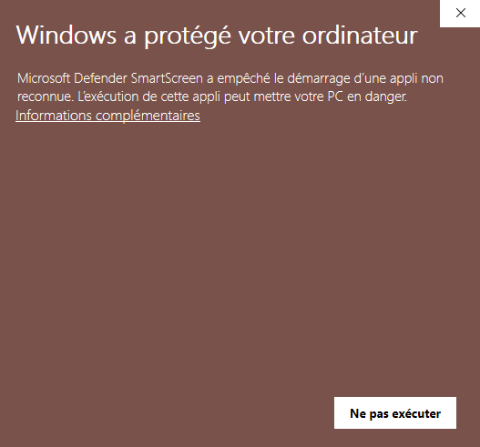

# Arduino-Logique

([Français](#instructions-dinstallation))

[](https://github.com/Team-Arduino-Logique/Arduino-Logique/releases/latest)
[](https://github.com/Team-Arduino-Logique/Arduino-Logique/tags)

[](https://github.com/Team-Arduino-Logique/Arduino-Logique/issues)
[](https://github.com/Team-Arduino-Logique/Arduino-Logique/blob/master/LICENSE)
[](https://github.com/Team-Arduino-Logique/Arduino-Logique/actions/workflows/pylint.yml)
[](https://github.com/Team-Arduino-Logique/Arduino-Logique/actions/workflows/release_pipeline.yml)

## Contents

- [Installation Instructions (English)](#installation-instructions)
  - [MacOS installation](#macos-installation)
  - [Windows installation](#windows-installation)
  - [Microcontroller](#microcontroller)
- [Instructions d'installation (Français)](#instructions-dinstallation)
  - [Installation sur MacOS](#installation-sur-macos)
  - [Installation sur Windows](#installation-sur-windows)
  - [Microcontrôleur](#microcontrôleur)

## Installation Instructions

Please go to the [release page](https://github.com/Team-Arduino-Logique/Arduino-Logique/releases) and download the latest release for your operating system.

### MacOS installation

#### Prerequisites for macOS

1. Install Python 3.
2. Install the required Python packages:
    - pyserial
    - tkmacosx

You can install the packages using pip:

```sh
pip install pyserial tkmacosx
```

To download the source code, you can clone the repository using git. Open a terminal and run the following command:

```sh
git clone https://github.com/Team-Arduino-Logique/Arduino-Logique.git
```

This will create a local copy of the repository on your machine.

#### Running `arduino_logique.py` on MacOS

After installing the prerequisites, you can run the `arduino_logique.py` script by navigating to the directory where the script is located and executing the following command in the terminal:

```sh
python arduino_logique.py
```

### Windows installation

Windows Defender will warn you about an unverified program. You can still execute it by clicking "More information", then "Continue".

### Microcontroller

#### TODO instructions for microcontroller

## Instructions d'installation

Veuillez vous rendre sur la [page des versions](https://github.com/Team-Arduino-Logique/Arduino-Logique/releases) et télécharger la dernière version pour votre système d'exploitation.

### Installation sur MacOS

#### Prérequis pour macOS

1. Installez Python 3.
2. Installez les packages Python requis :
    - pyserial
    - tkmacosx

Vous pouvez installer les packages en utilisant pip :

```sh
pip install pyserial tkmacosx
```

Pour télécharger le code source, vous pouvez cloner le dépôt en utilisant git. Ouvrez un terminal et exécutez la commande suivante :

```sh
git clone https://github.com/Team-Arduino-Logique/Arduino-Logique.git
```

Cela créera une copie locale du dépôt sur votre machine.

#### Exécution de `arduino_logique.py` sur MacOS

Après avoir installé les prérequis, vous pouvez exécuter le script `arduino_logique.py` en naviguant vers le répertoire où le script est situé et en exécutant la commande suivante dans le terminal :

```sh
python arduino_logique.py
```

### Installation sur Windows

Lors de l'installation sur Windows, un avertissement de sécurité peut apparaître. Pour continuer, cliquez sur "Informations complémentaires", puis sélectionnez "Exécuter quand même".



### Microcontrôleur

#### TODO instructions pour microcontrôleur
