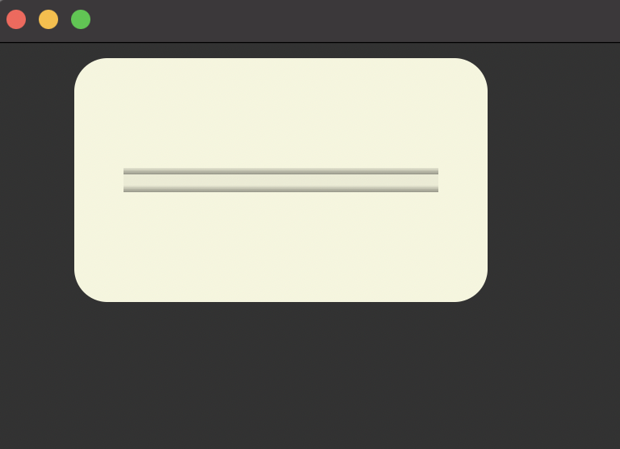
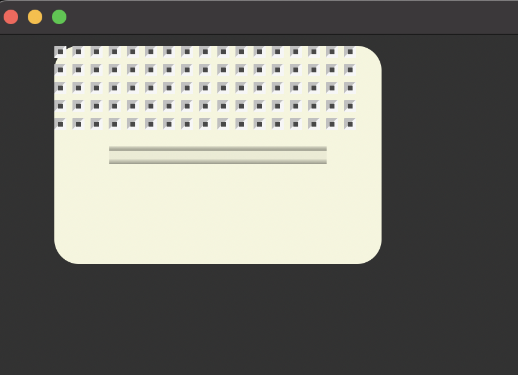
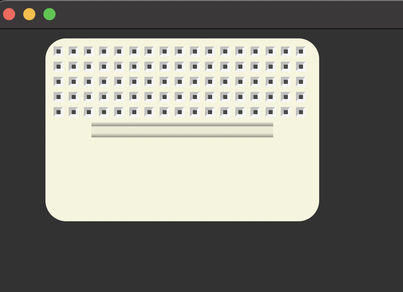
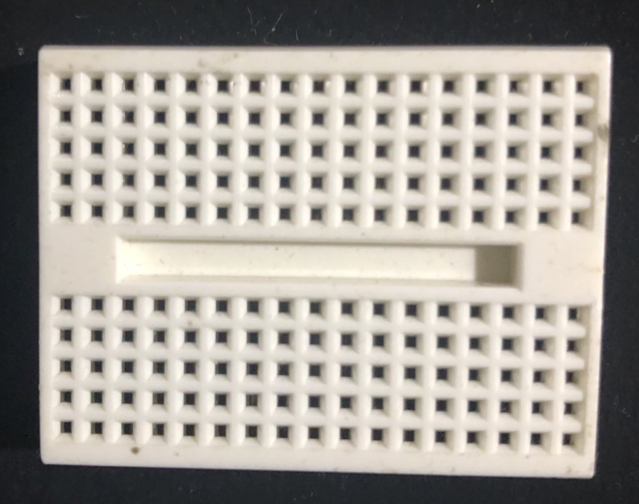

# ArduinoLogique
Projet design 4
# Description du projet

## 1) Philosophie du code

Le point d'entrée principal du projet est la fonction `circuit`, qui prend en entrée un modèle correspondant à une liste de description de circuit. Cette fonction est récursive, ce qui permet de gérer une imbriquation infinie de listes et donc d'avoir une structure hiérarchique illimitée pour la création ou l'installation de composants.

Cette approche rend le code modulaire (en théorie, car il reste encore quelques ajustements à effectuer).

## 2) Exemples

La suite des explications sera illustrée par des exemples afin d'être à la fois plus pragmatique et plus claire:
  - créer une plaquette
  - créer une puce
  - créer un cable
  - créer une entrée/sortie
  - créer un circuit

### a) Créer une plaquette:
Il existe 4 types de platine standart:

#### Types de Breadboard

##### - Mini Breadboard
- **170 points** : Une petite platine souvent utilisée pour des circuits simples ou des prototypes de petite taille.
- **Dimensions approximatives** : 45 mm x 34 mm.

##### - Half Size Breadboard
- **400 points** : Une platine de taille intermédiaire.
- **Dimensions approximatives** : 82 mm x 54 mm.
- **Distribution** : 300 points de connexion en zone centrale et 100 points pour les rails d'alimentation.

##### - Full Size Breadboard
- **830 points** : Une platine de taille standard couramment utilisée.
- **Dimensions approximatives** : 165 mm x 54 mm.
- **Distribution** : 630 points de connexion en zone centrale et 200 points pour les rails d'alimentation.

##### - Large Breadboard
- **1660 points** : Une grande platine pour des projets plus complexes.
- **Dimensions approximatives** : 200 mm x 160 mm.
- **Distribution** : 1260 points de connexion en zone centrale et 400 points pour les rails d'alimentation.

Le code permet de créer toutes ces plaques ou d'autres plus exotiques.
Le code exemple qui suit va nous permettre de concevoir la mini plaque de 170 points.

Nous commençons par créer la plaque avec son fond:

```python

import tkinter as tk
import platineEssai as pe
from tkinter import font

fen = tk.Tk()
fen.title("Laboratoire virtuel de circuit logique - GIF-1002")

# Créer un canvas (surface sur laquelle on dessine)
canvas = tk.Canvas(fen, width=1500, height=900)
canvas.pack()

xPlaque, yPlaque = 50,10
pe.init(canvas)
plaqueMini170 = [(pe.planche,1,{"lgLigne":17, "lgColonne":10, "sepAlim":[], "sepDistribution":[(2,4.5)]})]
pe.circuit(canvas,xPlaque ,yPlaque, modele = plaqueMini170)

fen.mainloop()
```


Les lignes de code les plus essentielles sont:

```python
plaqueMini170 = [(pe.planche,1,{"lgLigne":17, "lgColonne":10, "sepAlim":[], "sepDistribution":[(2,4.5)]})]
pe.circuit(canvas,xPlaque ,yPlaque, modele = plaqueMini170)
```

On crée un modèle plaqueMini170 c'est une liste contenant un appel de fonction et ses paramètres :
[(appel d'une fonction ou une autre liste, nombre d'appel, paramètres)]

La fonction appelée est planche() avec ses paramètres ici 10 bandes(lgColonne) de 17 trous (lgLigne) et un séparateur situé en x= 2+1 trous et y = 4.5 +1 bande de trou.
Quand le modèle est défini, on peut l'utiliser comme paramètre dans la fonction circuit qui en fait crée et gère le circuit modèle.
c'est la fonction circuit qui est le point d'entré du programme, c'est une fonction récursive qui lit les listes et les interprète.

Ajoutons nos lignes de trous  en modifiant le code :

```python
ligneDistribution = [ (pe.trou, 17)] 
plaqueMini170 = [(pe.planche,1,{"lgLigne":18, "lgColonne":12, "sepAlim":[], "sepDistribution":[(3,5.5)]}), (ligneDistribution,5, {"sens":pe.VERTICAL})]
```
Nous créons une liste ligneDistribution qui dit à circuit d'appeler 17 fois la fonction trou, ce qui affiche une rangée de 17 trous.
Dans la liste plaqueMini170 on ajoute (ligneDistribution,5, {"sens":pe.VERTICAL}), on appelle donc 5 fois lignedistribution avec le paramètre sens=VERTICAL, ce qui indique qu'après une ligne on fait un saut vertical(une nouvelle ligne comme un retour chariot).
Voici le résultat :



Il reste à ajuster les lignes de distributions pour cela on va ajouter ceci :

```python
plaqueMini170 = [(pe.planche,1,{"lgLigne":18, "lgColonne":12, "sepAlim":[], "sepDistribution":[(3,5.5)]}), (pe.demiPlat,1,{"sens":pe.HORIZONTAL}),(pe.demiPlat,1,{"sens":pe.VERTICAL}),(ligneDistribution,5, {"sens":pe.VERTICAL})]

```
voici l'ajout isolé : (pe.demiPlat,1,{"sens":pe.HORIZONTAL}),(pe.demiPlat,1,{"sens":pe.VERTICAL}),

le demiPlat est une fonction qui permet d'ajouter un 1/2 espace à notre modèle. Un espace est la distance entre 2 trous.
Ici nous aurons un 1/2 espace sur l'horizontal et un autre sur la verticale.

le résultat : 


Réécrivons le code pour le rendre plus lisible et voir comment fonctionne la modularité:

```python
bandeDistribution = [(pe.demiPlat,1,{"sens":pe.HORIZONTAL}),(pe.demiPlat,1,{"sens":pe.VERTICAL}),(ligneDistribution,5, {"sens":pe.VERTICAL})]
plaqueMini170 = [(pe.planche,1,{"lgLigne":18, "lgColonne":12, "sepAlim":[], "sepDistribution":[(3,5.5)]}), (bandeDistribution,1,{"sens":pe.VERTICAL})]

```
Nous ne faisons que créer une nouvelle liste contenant nos 5 lignes de distributions, puis cette liste est insérée dans le modèle de plaqueMini170.
Cela ne change rien au résultat mais simplifie la lecture du code mais va surtout nous permettre de réutiliser le code pour la suite.

La suite du modèle de plaqueMini170 est une deuxième bande de distribution placée plus bas. 

Nous changeons le modèle de plaqueMini170 ainsi:

```python
plaqueMini170 = [(pe.planche,1,{"lgLigne":18, "lgColonne":12, "sepAlim":[], "sepDistribution":[(3,5.5)]}), (bandeDistribution,1,{"sens":pe.VERTICAL}), \
                   (bandeDistribution,1)]

```
Nous ajoutons juste une nouvelle bande de distribution et le résultat est le suivant :


Assez proche dur réel :


Voilà pour la miniPlaque170 qui n'existait pas encore et que l'on peut intégrer à la bibliothèque.

Il reste le modèle Half Size Breadboard que je laisse en exercice...;-)

Ah! le code au complet :

```python
import platineEssai as pe
from tkinter import font

fen = tk.Tk()
fen.title("Laboratoire virtuel de circuit logique - GIF-1002")

# Créer un canvas (surface sur laquelle on dessine)
canvas = tk.Canvas(fen, width=1500, height=900)
canvas.pack()

xPlaque, yPlaque = 50,10
pe.init(canvas)
ligneDistribution = [ (pe.trou, 17)] 
bandeDistribution = [(pe.demiPlat,1,{"sens":pe.HORIZONTAL}),(pe.demiPlat,1,{"sens":pe.VERTICAL}),(ligneDistribution,5, {"sens":pe.VERTICAL})]
plaqueMini170 = [(pe.planche,1,{"lgLigne":18, "lgColonne":12, "sepAlim":[], "sepDistribution":[(3,5.5)]}), (bandeDistribution,1,{"sens":pe.VERTICAL}), \
                   (bandeDistribution,1)]
pe.circuit(canvas,xPlaque ,yPlaque, modele = plaqueMini170)

fen.mainloop()
```

